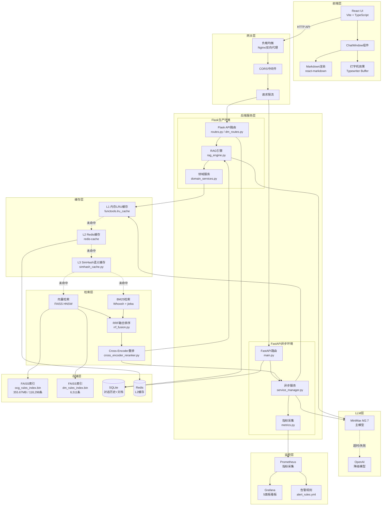
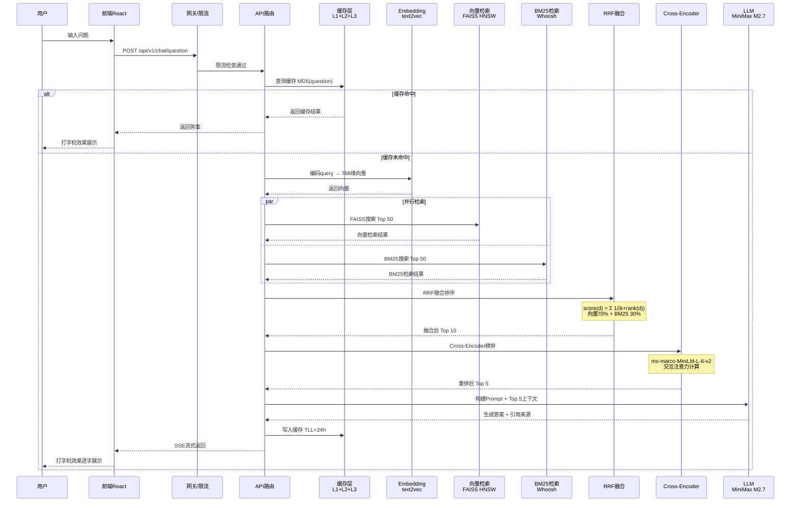
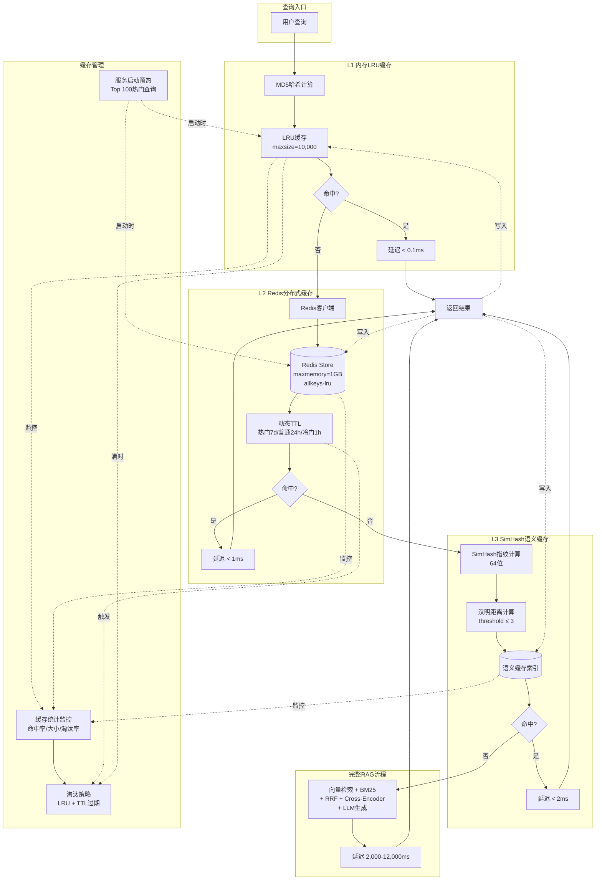
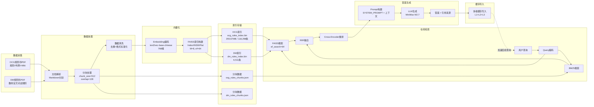
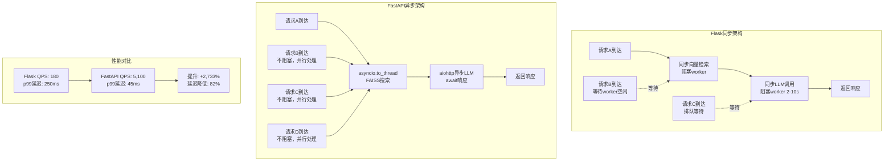

# OCG/DM规则书RAG问答系统 - 架构图

> 格式：Mermaid（支持Markdown渲染）
> 生成日期：2026-05-23

---

## 一、系统整体架构图



---

## 二、检索流程时序图



---

## 三、多级缓存架构图



---

## 四、数据流向图



---

## 五、监控数据流图

```mermaid
graph TB
    subgraph 数据采集
        M1[HTTP请求计数器<br/>http_requests_total]
        M2[请求延迟直方图<br/>http_request_duration_seconds]
        M3[缓存命中率<br/>cache_hit_rate]
        M4[RAGAS指标<br/>faithfulness / precision / recall]
        M5[错误计数器<br/>http_errors_total]
    end

    subgraph 指标导出
        METRICS[/metrics 端点<br/>Prometheus格式]
    end

    subgraph Prometheus
        SCRAPE[定时采集<br/>interval=15s]
        TSDB[(时序数据库<br/>TSDB)]
    end

    subgraph Grafana
        DASH[Dashboard<br/>5个面板]
        P1[QPS实时曲线]
        P2[p50/p95/p99延迟]
        P3[缓存命中率]
        P4[RAGAS 4项指标]
        P5[错误率趋势]
    end

    subgraph 告警
        RULES[告警规则<br/>alert_rules.yml]
        R1[QPS < 1000]
        R2[p99 > 5s]
        R3[缓存命中率 < 50%]
        R4[Faithfulness < 0.8]
        NOTIFY[通知渠道<br/>飞书/邮件]
    end

    M1 --> METRICS
    M2 --> METRICS
    M3 --> METRICS
    M4 --> METRICS
    M5 --> METRICS
    
    METRICS --> SCRAPE
    SCRAPE --> TSDB
    TSDB --> DASH
    
    DASH --> P1
    DASH --> P2
    DASH --> P3
    DASH --> P4
    DASH --> P5
    
    TSDB --> RULES
    RULES --> R1
    RULES --> R2
    RULES --> R3
    RULES --> R4
    
    R1 --> NOTIFY
    R2 --> NOTIFY
    R3 --> NOTIFY
    R4 --> NOTIFY
```

---

## 六、FastAPI异步架构对比图



---

*本架构图使用Mermaid语法，可在支持Mermaid的Markdown编辑器中渲染*
*推荐工具：Obsidian、GitHub、Notion、VS Code + Mermaid插件*
